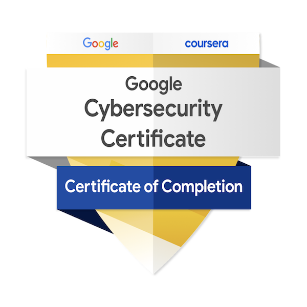
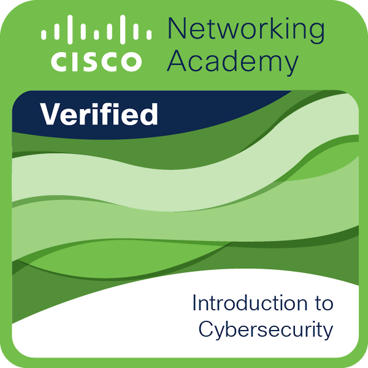
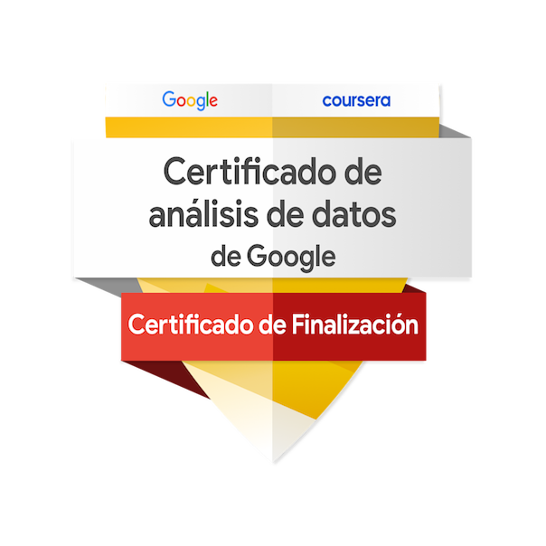

# Hector Mejias

### Windows Systems Administrator | SOC Analyst | Identity & Access Management (IAM)

## Technical Skills

* Active Directory Domain Services (AD DS)
* Windows Server Administration
* Group Policy & Group Policy Preferences
* Identity & Access Management (IAM)
* Windows LAPS
* DNS & File Server
* Wazuh SIEM
* PowerShell Automation
* Network Fundamentals (TCP/IP, VLANs)
* Linux (Parrot OS, Ubuntu, Kali & Fedora)
* Bash & Python Automation

## Featured Projects
* Enterprise Active Directory Administration Lab
* SOC Lab with Wazuh & Active Directory
* SSH Brute Force Detection (Bash)
* Incident Dashboard (Power BI)

## Currently Learning
* Identity & Access Management (IAM)
* Windows Enterprise Administration
* SIEM Engineering
* Detection Engineering
* PowerShell Automation
* Microsoft Entra ID

## Contacto
* hlmejiasmartinez@gmail.com
* GitHub: https://github.com/hlmejias

## Badges
* https://www.credly.com/users/hector-mejias.27f7a33d/badges/credly

                        
